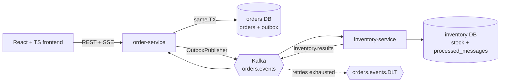

# Architecture

```mermaid
flowchart LR
  UI[React + TS frontend] -- REST + SSE --> OS[order-service]
  OS -- same TX --> ODB[(orders DB<br/>orders + outbox)]
  OS -- OutboxPublisher --> K{{Kafka<br/>orders.events}}
  K --> IS[inventory-service]
  IS --> IDB[(inventory DB<br/>stock + processed_messages)]
  IS -- inventory.results --> K
  K --> OS
  K -. retries exhausted .-> DLQ{{orders.events.DLT}}
```

Order lifecycle: `PENDING -> CONFIRMED | REJECTED | CANCELLED`, `CONFIRMED -> CANCELLED`.

Fill in as built: topic names, event schemas, failure modes and what happens in each.
